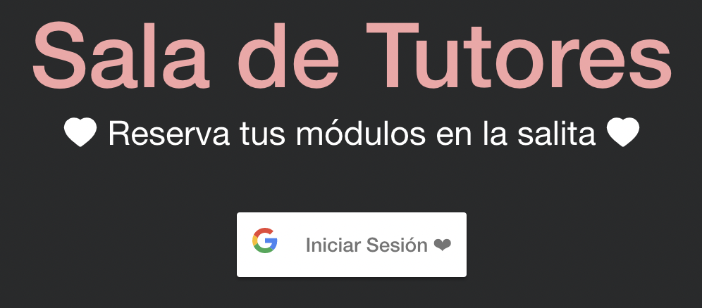
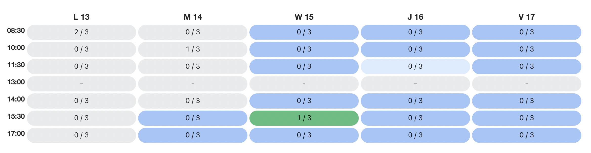

# Front-end Sala de Tutores ❤️

¡Hola! Este es el repositorio del *front-end* de la usado para la página de reservas de módulos en la Sala de Tutores.

## Modo de Uso 🤓
A continuación explicamos cómo reservar tu módulo:

1. Al entrar verás lo siguiente: 
   
    Deberás presionar el botón **Iniciar Sesión** para sincronizar tu cuenta de Google y utilizar el sitio.

1. Luego verás el horario: 
   
   Aquí podrás seleccionar usando *click* el o los horarios que quieras estar en la sala. Por ahora no puedes estar dos módulos seguidos. Haciendo *click* nuevamente quitas tu reserva, y al hacer *hover* podrás ver a les tutores que estarán contigo ese módulo 🙌

1. Por último, solo queda presionar el botón **Enviar** y la reserva quedará hecha! 🚀